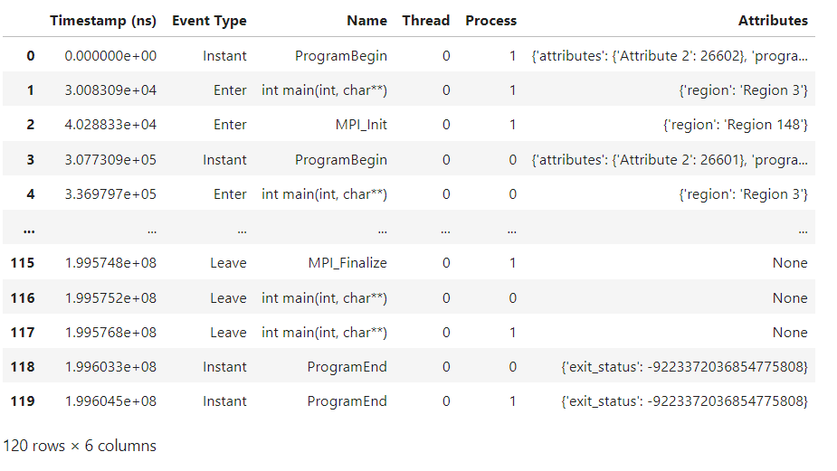
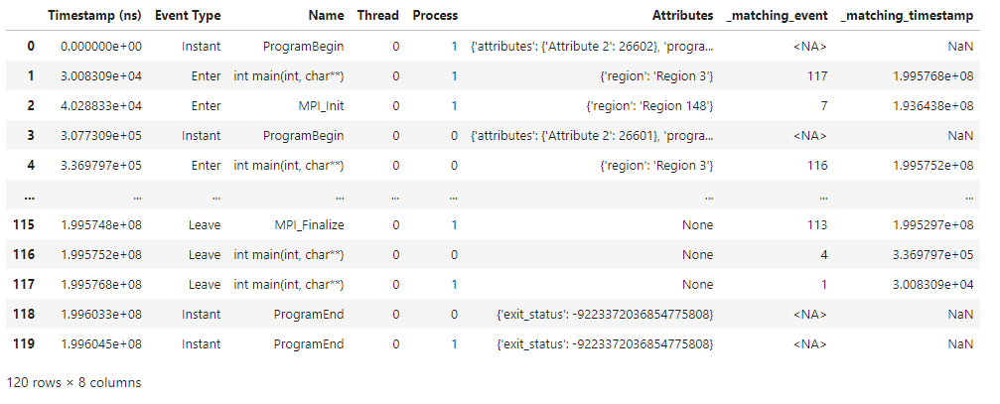
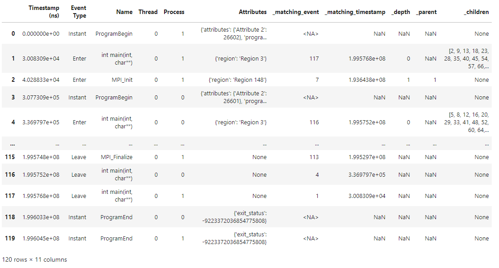
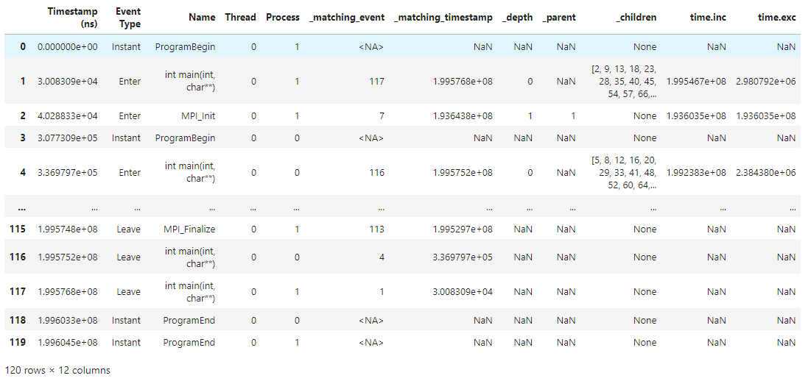
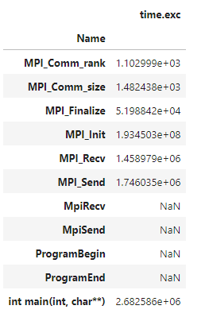
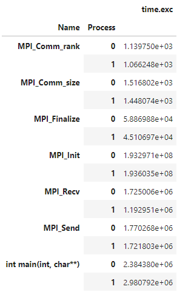
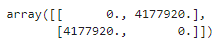
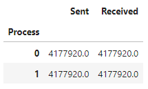
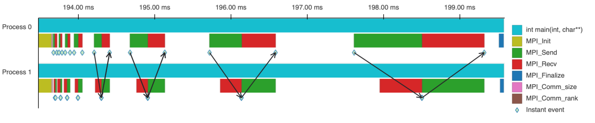

.. Copyright 2022-2023 Parallel Software and Systems Group, University of
   Maryland. See the top-level LICENSE file for details.

   SPDX-License-Identifier: MIT

**********
User Guide
**********

This guide will get you started working with Pipit as quickly as possible. Pipit can be used in a Python
shell or file, but we highly recommend using it within a Jupyter notebook.

Assuming that you have installed Pipit, let's begin by importing it.

.. code-block:: python

  import pipit as pp

Data Structures in Pipit
========================

The primary data structure in Pipit is the ``Trace`` object, which corresponds to
a trace dataset on disk. The ``Trace`` object contains useful attributes, as
well as functions, to facilitate analysis of the underlying data. An important
attribute in the ``Trace`` object is the ``events`` DataFrame, which contains
the event data in a tabular format.

Reading in a Dataset
====================

We can read an OTF2 trace dataset into Pipit's ``Trace`` object as such:

.. code-block:: python

  trace = pp.Trace.from_otf2("pipit/pipit/tests/data/ping-pong-otf2")

Let's examine how Pipit has parsed events in the ``ping-pong-otf2`` dataset:

.. code-block:: python

  trace.events

The trace events are parsed into a Pandas DataFrame, where each row represents an event
and each column represents an attribute of that event.

Standard Columns
================

Let's break down the columns above to get an understanding of what they mean:

**Timestamp (ns)** represents the timestamp, in nanoseconds, at which the event occured.

**Event Type** represents the nature of that event, and is one of three values:

* **Enter**: This event indicates that the program has started execution of a region of code (usually when a function is invoked)
* **Leave**: This event indicates that the program has ended execution of a region of code (usually when a function returns)
* **Instant**: This event is instantaneous, and is typically an MPI communication event (like "send" or "receive")

Therefore, a function invocation is represented by a pair of Enter and Leave events.

**Name** represents a descriptive identifier associated with the event. For Enter and Leave events, this is usually the name of the
function.

**Thread** represents the thread in which the event occured, and **Process** represents the process in which the event occured.
Depending on the program, measurement tool, and trace format, these may correspond to different hardware resources.
For traces of MPI programs, Process represents the MPI rank.

**Attributes** represents additional information or metadata of that event. For instance, for Instant events
associated with MPI communication, this may contain the size of the message being sent or received.

Pipit can read and parse a variety of trace formats into this DataFrame representation. Currently, it supports
the following formats:

* `HPCToolkit <http://hpctoolkit.org/index.html>`_
* OTF2
* Nsight
* Projections

However, by writing a custom reader that parses event data into the above columns, Pipit can 
easily be extended to accomodate any format.

Trace Operations
================

Extracting Calling Relationships
--------------------------------

Let's say we would like to calculate the duration of a function call.
A function invocation consists of an Enter event (when the function starts executing),
and a Leave event (when the function returns), so it's useful to
match these two events with one another:

.. code-block:: python

  trace._match_events()
  trace.events

Now, we have two new columns in the DataFrame, **_matching_event**
and **_matching_timestamp**, which represent the index and timestamp of the
corresponding Leave event (for Enter events), and the corresponding Enter event
(for Leave events).

This makes calculating the time spent for each function invocation (that is,
for each Enter/Exit event) as simple as:

**total time = |_matching_timestamp - Timestamp (ns)|**

What if, instead of the total time spent in a function call, we want to
calculate the *exclusive* time spent in a function? That is, we would like
to subtract the time spent in all children function calls?

**exclusive time = time spent - ∑ time spent in children**

For such a calculation, we need to know the child events associated with
each event:

.. code-block:: python

  trace._match_caller_callee()
  trace.events

So far, we've added several columns to the DataFrame: _matching_event,
_matching_timestamp, _depth, _parent, and _children. As you'll see, Pipit lets users add as many columns
as necessary to faciliate analysis. Having such intermediate results makes it easier to perform
further calculations.

Analyzing Overall Performance
-----------------------------

Now that we have read in trace data and done some fundamental pre-processing on the events,
we are ready to perform analysis.

.. code-block:: python

  trace.calc_inc_metrics()
  trace.events
  

.. image:: images/calc_inc_metrics.png
   :width: 700

We add yet another column to the DataFrame: **time.inc**. As discussed above, this column contains
the *inclusive* (or total) time spent on a particular function invocation. While a function invocation
is represented by an Enter row and a Leave row, we only store this value on the Enter row to avoid
taking up extra space. Instead of doing this calculation discussed above, Pipit has done it for us.

.. note::
   Pipit computes the inclusive time using the same formula mentioned above,
   with some added bells and whistles (like handling edge cases). In addition,
   ``calc_inc_metrics`` calculates not only the inclusive time, but also
   other inclusive metrics that may be present in the trace, like values of hardware counters.

Similarly, we can compute the *exclusive* (also known as "self") time spent on each function call:

.. code-block:: python

  trace.calc_exc_metrics()
  trace.events
  

Again, our DataFrame is populated with a new column, **time.exc**, representing this value. Pipit
has subtracted the times taken by all children functions to calculate the exclusive time.

.. note::
   If you are familiar with Pandas, try doing ``trace.events.sort_values("time.exc", ascending=False)``.
   This will return a copy of the ``events`` DataFrame, sorted from the longest function execution
   to the shortest, letting you quickly see which function calls are taking the most time.

Finally, let's take a look at the trace's *flat profile*. A flat profile is an aggregation 
of some metrics, usually by function name. For instance, we can easily see the *total* inclusive
and exclusive times taken by each unique function:

.. code-block:: python

  trace.flat_profile()

We can also break this down per process:

.. code-block:: python

  trace.flat_profile(per_process=True)

.. note::
   Notice how in the past two examples, we don't call ``trace.events`` at the end. This is because
   the ``flat_profile`` function *returns* a DataFrame containing the flat profile. In the previous
   examples, ``calc_inc_metrics`` and ``calc_exc_metrics`` don't return anything -- they perform
   computations and store it in the ``events`` DataFrame.

Analyzing Communication Performance
-----------------------------------

While Pipit has plenty of other useful functions for analyzing compute performance,
the other major source of bottleneck in HPC applications is communication performance.
Pipit provides useful API functions to help us understand how communication
bottlenecks may impact our application.

The *communication matrix* of an application is a 2D array containing
the volume of exchanged between pairs of processes. When MPI communication data is present
in the trace, Pipit can compute and output the communication matrix:

.. code-block:: python

  trace.comm_matrix()

In this matrix, the first dimension is the *sending* process, and the second dimension
is the *receiving* process. Therefore, we can get the number of bytes that process *a*
sends to process *b* like so:

.. code-block:: python

  cm = trace.comm_matrix()
  cm[a][b]

Additionally, it may be helpful to find the *total* number of bytes sent by
each process to identify communication imbalance. 

.. code-block:: python

  trace.comm_by_process()

.. Identifying Performance Issues
.. ------------------------------

.. Here are some advanced operations that attempt to simplify the
.. identification of performance issues.

.. **load_imbalance:**

.. **idle_time:**

.. **outlier_detection:**

.. **pattern_detection:**

.. **multi_run_analysis:**

.. Data Reduction
.. --------------

.. Pipit also supports filtering the DataFrame by different parameters to reduce the amount of data to analyze at a time. A user might be interested in analyzing the traces for a subset of processes or for a time period smaller than the entire execution.

.. **filter:**

Visualizing the Data
====================

While Pipit has been primarily designed for programmatic analysis, it also includes
a basic visual interface to complement the API functions. 

A natural visualization for event traces is a timeline, also known as a gantt chart:

.. code-block:: python

  trace.plot_timeline()

In addition, Pipit provides visualization support for the results of many of its
analysis functions. The visualization API closely mirrors the programmatic API:

.. code-block:: python

  trace.plot_flat_profile()

.. code-block:: python

  trace.plot_comm_matrix()

.. warning::
   The visual interface is still a work-in-progress, and can be tested out
   in the ``vis`` branch.

Summary
=======

In this guide, you have learned the basics of the Pipit library. The workflow can be summarized as follows:

1. Import the Pipit library.
2. Read a trace dataset into a ``Trace`` instance.
3. Use ``Trace`` instance methods to perform calculations and analysis as necessary.

.. note::
   For advanced Python users, especially those familiar with Pandas and NumPy, Pipit 
   exposes the ``events`` DataFrame for custom analysis.

This guide serves to provide a gentle introduction to Pipit, and not enumerate all of its
API functions and features. We would highly recommend checking out example notebooks as well as
the Pipit API docs to see the full functionality of the library.

Pipit can be used to perform automated analysis, via Python scripts, as well 
as exploratory analysis, by means of Jupyter notebooks. Since performance bottlenecks
are not typically known ahead of time, we highly recommend using Pipit within a Jupyter notebook
to interactively understand your performance data and gain valuable insights.