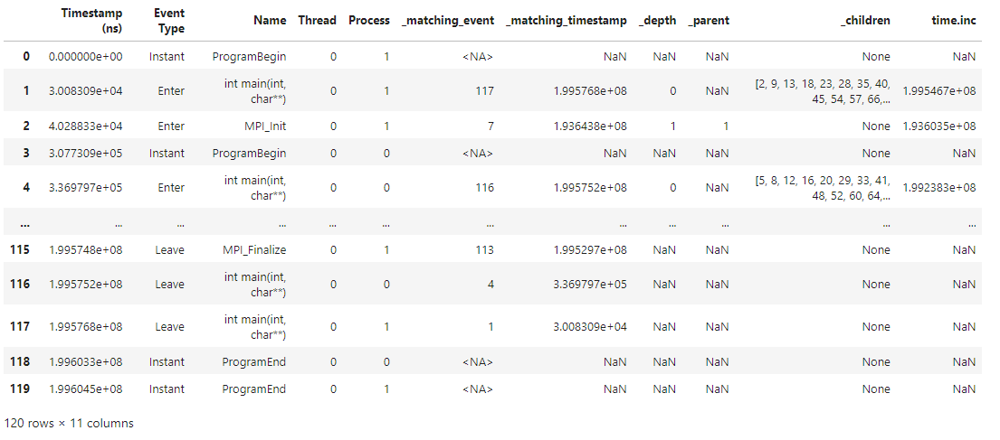

.. Copyright 2022-2023 Parallel Software and Systems Group, University of
   Maryland. See the top-level LICENSE file for details.

   SPDX-License-Identifier: MIT

**********
User Guide
**********

Data Structures in Pipit
========================

Reading in a Dataset
====================

Trace Operations
================

Extracting Calling Relationships
--------------------------------

Raw traces are organized in the form of enter, leave or instant events and
their timestamps. We need to traverse and manipulate the DataFrame in the Trace
object to match rows that represent the start and end of a function or to
identify parent-child relationships using the nesting of events.  These
functions are necessary in order to start making sense of trace data in terms
of user functions and their calling contexts.  These functions are described
below.

**_match_events:**
In order to calculate the time spent in a function and its children,
we need to match corresponding enter and leave rows for each function invocation.
This is also useful in other higher level API functions.

The _match_events function matches the enter and leave rows of each
function invocation by adding two columns in the DataFrame that store the row
index and timestamp of the corresponding enter or leave. This is done per
process and per thread in the case of a parallel trace. To identify matching
enter/leave rows, we iterate over the rows in the DataFrame, and every time an
enter row is encountered, we pushes its row index and timestamp to a stack.
Every time a leave row is encountered, we pop the top of the stack, which is
the matching enter row index and timestamp for that leave row. These are added
to the the appropriate rows in the DataFrame to form two new columns.

A simple example of the resulting columns created from trace._match_events() are displayed below:

.. image:: images/_match_events.png
   :width: 600

**_match_caller_callee:**
The _match_caller_callee function identifies parent child relationships by traversing
the DataFrame and creating three new columns in the DataFrame: row index of a
function invocation's parent, list of row indices of all its children, and its
depth in the calling context tree. Note that these values are only stored in the
enter rows of events.

Similar to _match_events}, the DataFrame is filtered to enter/leave events for the current process and thread being iterated over.
Using a stack of DataFrame indices, it keeps track of the parent index. For enter rows, it peeks the stack to get the parent index which
is used to modify the current event's parent and the parent's children. The current depth in the call tree is also incremented.
When a leave row is encountered, an element is popped from the stack and the current depth is decremented.

An example of the resulting 3 new columns added by trace._match_caller_callee() are as follows:

.. image:: images/_match_caller_callee.png
   :width: 600

**_create_cct:**

Analyzing Overall Performance
-----------------------------

Below is a list of descriptions of API functions that help analyze the time spent in different parts of the code.

**calc_inc_metrics:**
This function calculates the inclusive time and other metrics associated
with each function invocation. Since the events DataFrame originally contains
records of timestamps and other hardware counter readings for Enter/Leave
of each function invocation, we need to first derive the inclusive values for
each metric (including execution time). The calc_inc_metrics function uses _match_events
to match indices of enter and leave rows. Once events are matched, corresponding pairs of
events can be used to calculate the inclusive metrics associated with each function.
Note that the inclusive values are only stored in the enter rows of events.

The function takes a parameter *columns* which can either be a string indicating a single
column or a list of columns for which to calculate inclusive metrics for. If this isn't specified,
the function adds a corresponding inclusive values column for every numerical column in the DataFrame.
An example of the result of the default command trace.calc_inc_metrics() is displayed in the image below:

**calc_exc_metrics:**
This function calculates the exclusive time and other metrics associated
with each function invocation. This function first calls calc_inc_metrics
to calculate inclusive values for each metric. It then uses the parent-child
relationships obtained from _match_caller_callee to subtract the children's metrics
from each parent function's inclusive values to get the exclusive metrics.
Note that the exclusive values are only stored in the enter rows of events.

The function takes a parameter *columns* which can either be a string indicating a single
column or a list of columns for which to calculate exclusive metrics for. If this isn't specified,
the function adds a corresponding exclusive values column for every numerical column in the DataFrame.
Note that if the inclusive values column does not exist prior to calling this function, it will also be calculated.
An example result of the default command trace.calc_exc_metrics() is displayed in the image below:

.. image:: images/calc_exc_metrics.png
   :width: 600

**flat_profile:**
Once we calculate the inclusive and exclusive metrics per function invocation,
we can use the power of pandas and operations such as groupby to easily calculate
the total time spent in each function. Note that calc_exc_metrics has to be called
prior to using this function.

This function takes three parameters and returns a DataFrame. The first, *metrics*, is a single string or list of strings
denoting the columns/metrics to be aggregated in the resulting DataFrame. If not specified, the default is aggregate all metrics.
The second, *groupby_column*, is the column over which to aggregate the metrics. If not specified, this defaults to the "Name" column.
The third, *per_process*, indicates whether the user wants to aggregate the metrics over process as well. The default for this is False
where metrics are summed over each process and then the average is taken (ex: average time spent in a function per process). However, if store
to true, the resulting DataFrame will be indexed by both the groupby_column values and the Process so that an average is not taken over processes.
The default values for all parameters, trace.flat_profile(), results in a DataFrame like this as an example:

**time_profile:**

Analyzing Communication Performance
-----------------------------------

Below is a list of descriptions of API functions that help analyze communication patterns.

**comm_matrix:**
This function computes the data exchanged between pairs of processes and
outputs that information as a two-dimensional (2D) numpy array.  Note that this
information is not available in all trace formats. It requires that each send
and receive event have the destination and source process respectively, and the
size of the message exchanged.

The first dimension of the returned 2D array is senders and the second dimension is receivers (ex: comm_matrix[sender_rank][receiver_rank]).
This function takes one parameter, *output*, which can either be "size" so that the returned 2D array contains the total number of bytes communicated or
"count" where the values are the number of messages exchanged instead. The default value for this parameter is "size". The default command, trace.comm_matrix(),
will result in a 2D array like the following image as an example:

**message_size_histogram:**

**comm_by_process:**

**comm_over_time:**

Identifying Performance Issues
------------------------------

Here are some advanced operations that attempt to simplify the
identification of performance issues.

**load_imbalance:**

**idle_time:**

**outlier_detection:**

**pattern_detection:**

**multi_run_analysis:**

Data Reduction
--------------

Pipit also supports filtering the DataFrame by different parameters to reduce the amount of data to analyze at a time. A user might be interested in analyzing the traces for a subset of processes or for a time period smaller than the entire execution.

**filter:**

Visualizing the Data
====================
